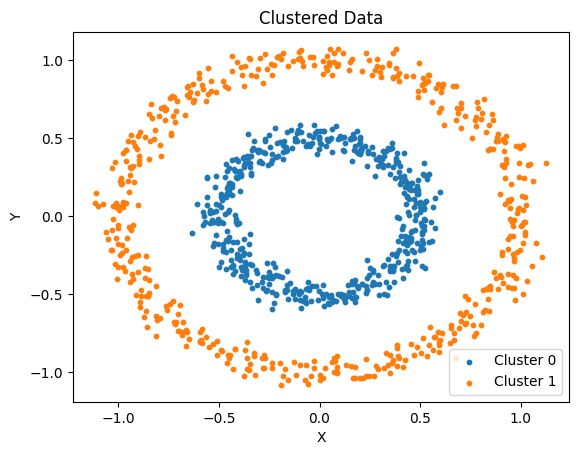
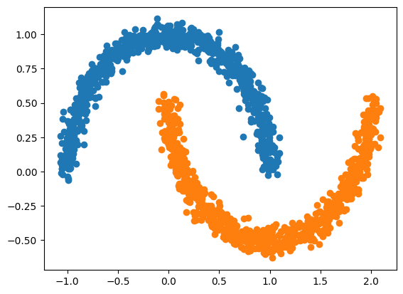

# data-clust
### v1

This GitHub repository is a go-to resource for a collection of open-source unsupervised machine learning libraries written from scratch. These libraries provide a diverse set of tools to help you uncover hidden patterns, discover valuable insights, and solve complex problems in the realm of unsupervised machine learning. This library contains the following Machien learning libraries:
- K Means clustering
- Gaussian Mixture model
- DB Scan
- Hierarchical clustering
- Principal Component Analysis (PCA)
- kernel PCA
- t-SNE
- KL Summarization
- Uniform Sampling
- 1d Gaussian Sampling
- 2d Gaussian Sampling
- Gibbs Sampling
- Latent Dirichlet allocation (LDA)

## Usage

### KMeans

The below code block demonstrates usage using the MNIST dataset:

```python
from keras.datasets import mnist
import numpy as np
from dataclust import kmeans

(trainX, trainY), (testX, testY) = keras.datasets.mnist.load_data()

#reshaping images
trainX = np.reshape(trainX, (-1, 784))
testX = np.reshape(testX, (-1, 784))

# normalize
trainX = trainX.astype('float32') / 255
testX = testX.astype('float32') / 255

labels, centroids = kmeans(trainX, 10)
```

### Gaussian Mixture model

The below code block demonstrates usage:
```python
import numpy as np
import matplotlib.pyplot as plt
from dataclust import GaussianMixtureModel

inputFile = open("./data/2gaussian.txt", 'r')
num_lines = len(inputFile.readlines())

dataset = np.zeros((num_lines, 2))
inputFile = open("./data/2gaussian.txt", 'r')
ind = 0
for line in inputFile:
    points = line.strip().split(" ")
    x = points[0]
    y = points[1]
    dataset[ind][0] = x
    dataset[ind][1] = y
    ind += 1

gmm = GaussianMixtureModel(k=2)
mean, cov, pi = gmm.fit_transform(dataset)
```

### DB Scan
The below code block demonstrates usage using a custom dataset:
```python
import numpy as np
import pandas as pd
from dataclust import dbscan
import matplotlib.pyplot as plt

data_circle = pd.read_csv(r'data/circle.csv')
df_circle = pd.DataFrame(data_circle, columns=['Xcircle_X1', 'Xcircle_X2'])
df_circle.rename(columns={'Xcircle_X1': 'x', 'Xcircle_X2':'y'}, inplace = True)

EPSILON = 0.1
MIN_PTS = 5

clustered = dbscan(EPSILON, MIN_PTS, df_circle)

idx , cluster = list(zip(*clustered))
cluster_df = pd.DataFrame(clustered, columns = ["ind", "cluster"])
raw_circle_data = df_circle.to_numpy()

for clust in np.unique(cluster):
    plt.scatter(raw_circle_data[cluster_df["ind"][cluster_df["cluster"] == clust].values, 0], raw_circle_data[cluster_df["ind"][cluster_df["cluster"] == clust].values, 1], s=10, label=f"Cluster{clust}")

plt.legend([f"Cluster {clust}" for clust in np.unique(cluster)], loc ="lower right")
plt.title('Clustered Data')
plt.xlabel('X')
plt.ylabel('Y')
```
This is how the clustered data looks after running DBScan \


### Hierarchical clustering
The below code block demonstrates usage using a custom dataset:
```python
import numpy as np
import pandas as pd
from dataclust import hierarchical_clust
import matplotlib.pyplot as plt

data_moons = pd.read_csv(r'data/moons.csv')
df_moons = pd.DataFrame(data_moons, columns=['Xmoons_X1', 'Xmoons_X2'])
df_moons.rename(columns={'Xmoons_X1': 'x', 'Xmoons_X2':'y'}, inplace = True)

#Perform clustering
raw_moons_data = df_moons.to_numpy()
d = hierarchical_clust(raw_moons_data,2)

# Visualize on a scatter plot
cluster1 = d[3]
cluster2 = d[2] - cluster1
cluster1_x = []
cluster1_y = []
cluster2_x = []
cluster2_y = []

for point in cluster1:
    cluster1_x.append(x[point])
for point in cluster1:
    cluster1_y.append(y[point])

plt.scatter(cluster1_x, cluster1_y)

for point in cluster2:
    cluster2_x.append(x[point])
for point in cluster2:
    cluster2_y.append(y[point])

plt.scatter(cluster2_x, cluster2_y)
plt.show()
```
This is how the clustered data looks after running Hierarchical clustering \
 


### PCA
The below code block demonstrates usage of PCA on mnist dataset
```python
from keras.datasets import mnist
import numpy as np
from dataclust import PCA

(trainX, trainY), (testX, testY) = keras.datasets.mnist.load_data()

#reshaping images
trainX = np.reshape(trainX, (-1, 784))
testX = np.reshape(testX, (-1, 784))

# normalize
trainX = trainX.astype('float32') / 255
testX = testX.astype('float32') / 255

#Run PCA
pca = PCA(5)
pca.fit(trainX)
projection_train_mnist = pca.transform(trainX)
projection_test_mnist = pca.transform(testX)

#test accuracy

```


### k-PCA
The below code block demonstrates usage of k-PCA on mnist dataset
```python
from keras.datasets import mnist
import numpy as np
from dataclust import kernelPCA

(trainX, trainY), (testX, testY) = keras.datasets.mnist.load_data()

#reshaping images
trainX = np.reshape(trainX, (-1, 784))
testX = np.reshape(testX, (-1, 784))

# normalize
trainX = trainX.astype('float32') / 255
testX = testX.astype('float32') / 255

#Run kernal PCA
X3G,X20G,X100G = kernelPCA(trainX)

#test accuracy

```